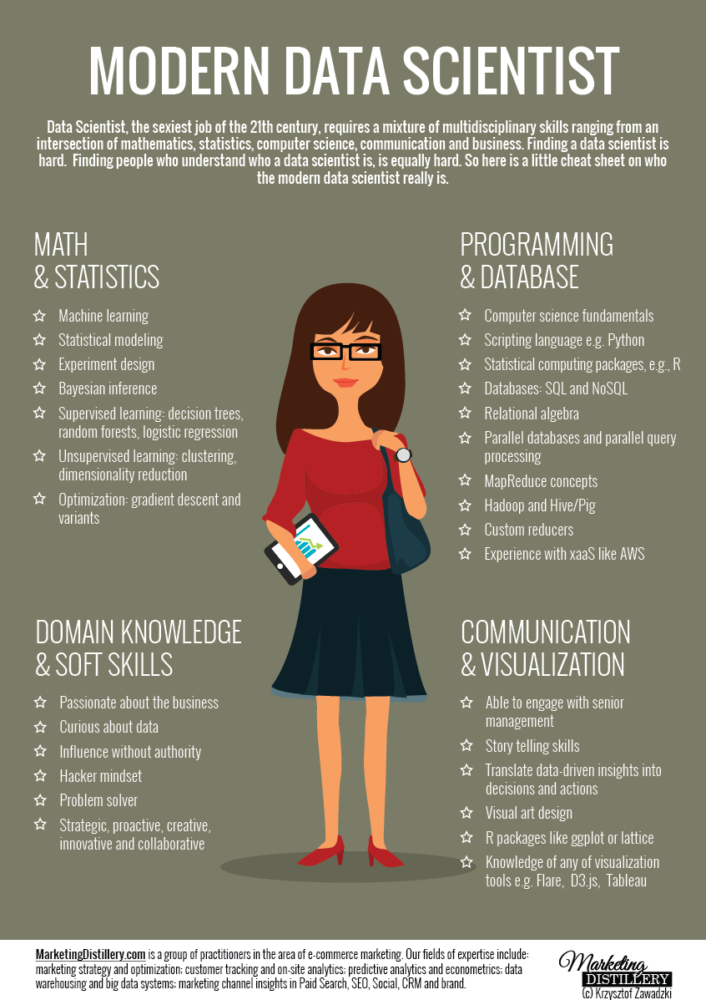

          
          

## Today
- Introductions
- Program Requirements
- What is data science? What do we hope to get out of this? 
- Python vs R 
- What you need to know to succeed with data science

<section>
</section>

## Let's get to know one another

## Jon Atwell
- Michigan PhD, 2017 - Sociology
- Studies the emergence of culture and norms
- Expertise: Python, text methods, agent-based modeling, experiments

## Chris Skovron 
- Michigan PhD, 2017 - Political Science
- Studies public opinion and what people believe about it
- Expertise: R, statistical modeling, causal inference

## We expect from you 
- Sustained commitment to integrating data science methods in your research
- Be a resource for your colleagues, both students and faculty 
- Be flexible, open to struggling and learning new things about yourself and your research 

## Program requirements 
- Three sessions this week
- At least four additional sessions. Intro R and Python count as two sessions. 
- Optional but suggested to attend afternoon practice sessions for workshops. 
- Participate in future data science programming put on by Data Science Initiative 

## Program support
- Jon and I will be mentors
- We aren't here to debug but will help you strategize and find resources
- Research Computing Services is another source of support 

## What is data science? 
<aside class="notes">Data science really is just the analysis of data, in scientific and unscientific ways. That means academics have 
been doing data science for a long time but under different names. 
We</aside>
 - the analysis of data ¯\\_(ツ)_/¯

## Etymology
- Naur, "Datalogy" (1974)
- Was proposed that statistics rename itself to DS (1997)
- Today's use comes via computer science (Classification Society conf. 1996)

## What does it mean in practice today?   Everything and Nothing, IOHO
 What do LIDAR and Tweets have in common? 
  - Only data scientists!
 Ok, sophisticated processing and analysis algorithms too

## Ok, what does it mean in the academy?
- New data sources and types
- Non-regression-based quantitative empirical analytical approaches.

## Why are we here?
<aside class="notes">JA's account is that in the aughts business realized they had infrastructures collecting lots of data  
but they weren't using it well. Business analytics had been around for a long time but platforms like Facebook made it clear that treating 
clients or users as units of analysis was possible and valuable. So they turned to the people already in their employ that had the skills to handle these 
data, the programmers. Then they wanted more of these people, with more specialized skills. Data science became the organizing term for this market. Universities 
obliged and took up their role in driving supply for the market. Formalization through highly respected institutions like universities help legitimize everything. 
</aside>
 Business got more serious about analytics 

## Related concepts and disciplines
- Information Sciences
- "Big data"
- Machine learning
- Computational Social Science

## Northwestern Data Science Initiative definition
- New analytic methods
- New sources
- Defined relative to what has historically been typical in disciplines 

## New data sources
- Text, tweets
- Experiments conducted online, in the field at scale 
- More technical data used to analyze social behavior: satellite lights

## New methods
- A plethora of new text methods
- Machine learning methods 
- Fine-grained measurement (geolocations, etc)

## New scales 
- Surveys are bigger and more frequent
- People leave more traces of themselves online 
- We can observe social behavior using new technologies 

## Beware the hype
- People have incentives to play up how fancy their data and methods are
- Important to keep a critical eye to whether people are being honest about why they use the data they do and the method they do
- Don't become a data science supremacist
- OLS is often just as good and orders of magnitude simpler than fancy methods!
- It's important to have a good bullshit detector when working in this area 

## Pitfalls for inference
- As social scientists, we need to remember that using new data science tools doesn't remove or obligations to do good research design
- Bigger data or more computationally intensive approaches also present new challenges for transparency 
- Just because you have the full population doesn't mean you can speak to causality, etc
- Big data doesn't always mean your findings are generalizable 

## Why CESS? 

## CESS students were chosen because
- You already show creativity and promise in your research projects and ideas
- Many of these projects could benefit from data science approaches 
- You don't already know all the things we are going to teach

## Much of what we are working on in CESS is not really taught anywhere in the social sciences 
- We focus on statistics in methods classes, which is great
- But doing that at the scale required for data science requires organization and an understanding of how computing works 
- Most of us in social science don't have extensive programming experience 
- This is tacit knowledge Chris and Jon learned the hard way. We want to help you make it through this thicket faster than we did

## Principles for being successful in applying data science to social science
- Get organized
- Know the landscape of available tools and resources
- Know what you need to know
- Understand how to teach yourself

## Working together is a key
- CESS is a community of students facing similar challenges and opportunities
- Working collaboratively on programming requires some vulnerability, but community is essential 
- You should work on getting comfortable with asking peers for help 
- You should share what you know and tricks you pick up with peers and with faculty 

## Python vs R

## Where do you fit in DS?
  or, What you need (and don't need) to know to thrive _using_ computational tools
   or or, Relax and focus on what you need

## Part 1: The professional angle  

## 

## 

## 
  <aside class="notes">This person isn't pushing knowledge frontiers, works at least 55 hours a week and has little autonomy</aside>

## Academic research or industry?
  - You aren't effectively preparing for the latter here
  - Transition is getting harder
  - Both can be great, or terrible

## Part 2: The tools angle

## Machine Learning
  - Breiman, 2001: "Two Cultures"

## What generates data?
  <aside class="notes">machine learning doesn't preclude stochastic linear models</aside>
    The problem of statistical inference
     Statistics
     Machine Learning
  
## Supervised vs. Unsupervised
  - Supervised => You know values of dependent variable(s)
  - Unsupervised => You don't

## Specified model vs blackbox
  - Orthogonal to _supervised_ vs. _unsupervised_
  
## Supervised
  - High predictive power
  - more diversity of generating mechanisms the reg.
  - easily overfitted
  - can be blackbox
  
## Unsupervised
  - Lack groundtruth
  - define probablistic model/generative process
  - harder to overfit
  - can be blackbox

## Do you need supervised models?
  * Regression models, of course!
  * Classification? umm, probably not
    + Yet, lots of hype here

## Do you need unsupervised models?
  - text as data! 
  - clustering, yes
    + but not that new
  
## Part 3: The _good_ (academic) programmer angle

## No one knows it all, so relax
  - Be comfortable in that
  - But don't stop learning!

## Wrong emphasis: Efficiency
<aside class="notes">a computer science measure of the work to be done as a function of the number of input population size. Whole subfield dedicated to study of complexity, but it boils down to whether a process can run in sublinear, linear, or exponential time. Consider a population of size N. Drawing a random element from the pop doesn't depend on the pop size (sublinear). Taking the average does depend on N, because you have to visit each element. Finding the standard dev takes twice as long (calc mean, revisit each to calc error.), but it's still linear because you're just iterating over the list twice. But say one of your variables is the geocoordinates of the elements and you want to know the average distance between all elements in the population. You need to calculate the distance between all pairs of elements. In a population of size N, there are N(N-1) pairs. N(N-1) is very, very close to N^2. So in pop of 100, there are 10,000 operations to do to calc average distance. In a population of 1000, there are 1 mil operations. The number of observations increased 10 fold, but the number of operations increased 100 fold. That's exponential growth! You want to avoid exponential grow as much as you can if you want to be efficient.</aside>

Why? (more on Day 2) 
  - clocktime vs human scale 
  - but complexity matters.

## Wrong emphasis: Succinctness
  - Compactness often isn't good
  - (See the translation process)
  
## Correct emphasis: Scientific question
  - lead with questions, not methods

## Correct emphasis: Reproducibility
  - organized so others can reproduce result 
  - but working code not the same as.  ..

## Correct emphasis: Replicability
  - logic of code is clear
    + via comments and other documentation
    + via properly expressive code
    
    

