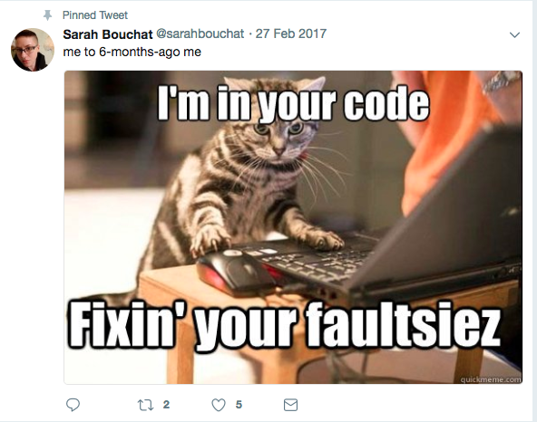
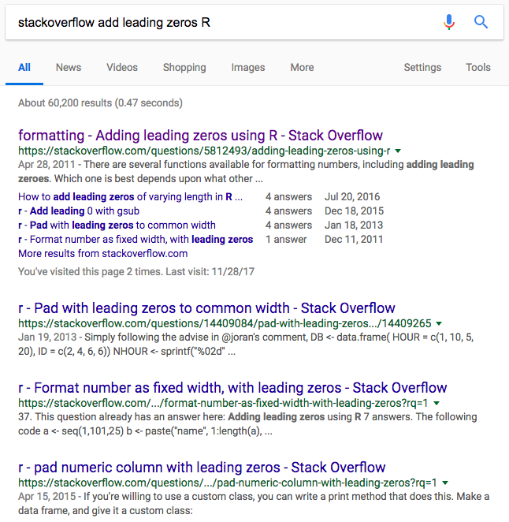
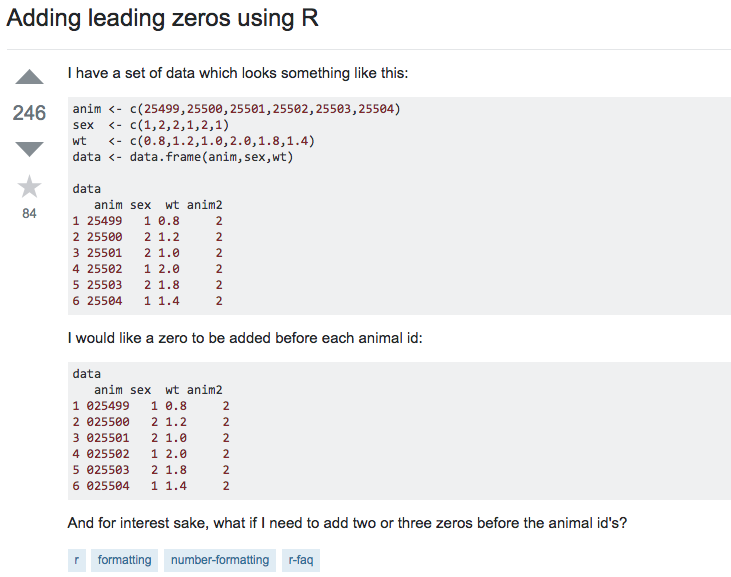
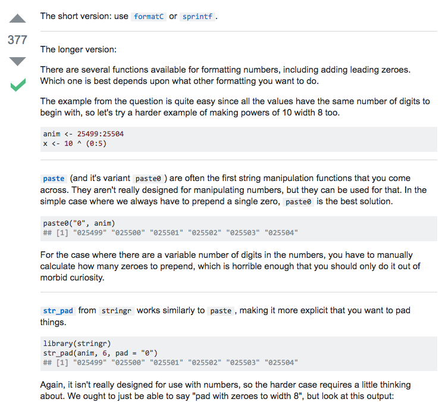
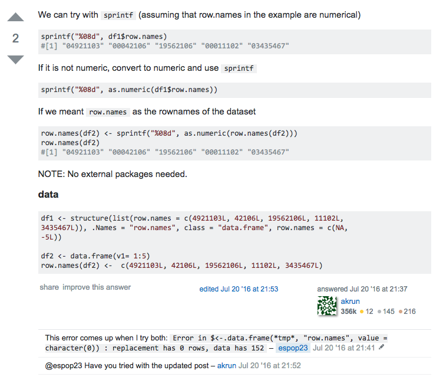
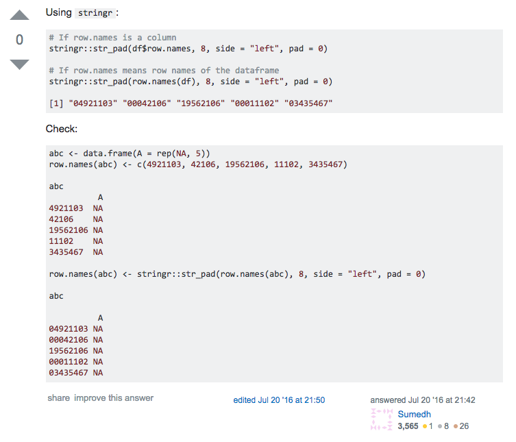

```{r setup, include = FALSE}
library(knitr)
```
          


## Learning to do computational research involves learning to write and read different things than you are used to


<section>
</section>
          
## You probably hear a lot about "clean" code 

## Most of that is bullshit and preening
- unless you are working in industry in a setting where things need to highly scale 
- remember the point from Day One about human scale 

## In a year or five years, you will look back on your past self's code and be horrified 




## Set yourself realistic goals in coding 
- Acquire data
- Clean it in (tidy) forms ready for analysis
- Analyze
- Visualize and communicate 

## These goals animate today's lesson, on how to teach yourself, and tomorrow's lesson on "getting organized"
- These goals require lots of practice. Halfway between muscle memory and an art form 


## Reading and writing documents related to coding
- You will be reading new kinds of documentation, vignettes, examples, error messages
- These will seem confusing at first
- There are strategies, but nothing can beat practice 

## Your goals in writing code are more modest 
- Does this do what I need it to do in a reasonably computationally efficient manner? 
- Will my future self understand it? 
- Will my collaborators and/or replicators understand it? 
- Have I written in such a way that will prevent me from making mistakes? 
We will address each of these goals in order. 


## Code should be 
- Easily understood by humans
- Relatively consistent 
- Able to be adapted to new situations 


## Some resources to orient you to best practicies in writing code

- Read points 1-8 of [this guide](https://www.r-bloggers.com/r-best-practices-r-you-writing-the-r-way/) (specific to R but applies to other languages)
- [Hadley Wickham's R style guide](http://adv-r.had.co.nz/Style.html)
- [Another good resource on R best practices.](https://swcarpentry.github.io/r-novice-inflammation/06-best-practices-R/)


## Pick good names
- You might be tempted to use abbreviations or non-words to save yourself from typing the same characters over and over
- With modern IDEs, tab completion means this is not a big issue
- Choose names that are legible, clear, and precise 
- Name functions what they do, name variables what they are 


## Good and bad names
In R, dots are common, underscores are ok:

```{r, eval=FALSE}
## a few bad variable names from my past work
incspendtran
V101 
gender # if coded as one or zero, as a factor I'd accept this 


## better names
increase.spending.transportation
respondent.id
female # coded 1 if female
```

## Similar variables should have similar names

- For example, my candidates' perceptions of things always begin with `perc.`
- Next, geography, are they perceiving district, `perc.district`, or state, `perc.state`
- Sometimes they are perceiving opinion within a party: `perc.district.dem`
- Then the issue: `perc.district.dem.marriage` means their district-level perception of support for same-sex marriage. `perc.district.guns.banassault` is district-level support for banning assault weapons. There's also `guns.background.check`....
- This lets me use things like `grep()` to grab variables that are similar


## Commenting

- Messages to all of your audiences -- most importantly to yourself 
- Say what you're doing in plain words and why you're doing it
- People differ a lot in their commenting preferences
- Find what's comfortable for you, let it evolve
- A good rule of thumb - if it's not obvious what's going on from a quick skim of the code, comment it 


## Principles of good commenting 

- Don't comment things that are painfully obvious
- But most things won't be painfully obvious 
- Comment to introduce each new section of code or each major task 
- If you write a new function, leave a comment explaining what it does 


## Introduce each new subsection of code with a comment

```{r, eval = FALSE}
# plot partisan estimates against one another
# voters only
g = ggplot(ncs, aes(voted.pid7.dem)) +
  geom_density(color = 'blue') + 
  theme_classic() +
  theme(legend.position='none') +
  xlim(0,1) +
  theme(axis.title=element_text(size=8), plot.title = element_text(hjust=0.5, size = 10)) +
  geom_density(aes(voted.pid7.rep), color = 'red') +
  ggtitle("Distribution of electorate partisanship estimates") +
  xlab("Percent of voters in district belonging to each party")

```

## More examples of comments form my code

```{r, eval = FALSE}
### POSTSTRATIFICATION ###

# set up poststratification file and poststratify 2014 MRSP models 

# level is upper or lower districts, pid.level is 3 or 7 point item 
get.cell.predictions <- function(individual.model,
                                 pid.var, # e.g., 'pid3.dem'
                                 pstrat){
  # district random effects need zeros for missing dists
  district.ranefs <- ranef(individual.model)$modgeoid
  missing.districts <- setdiff(unique(pstrat$modgeoid), rownames(district.ranefs))
  missing.districts.df <- data.frame(district = missing.districts)
  rownames(missing.districts.df) <- missing.districts.df$district
  missing.districts.df$`(Intercept)` <- 0
  missing.districts.df <- dplyr::select(missing.districts.df, -district)
  district.ranefs <- rbind.data.frame(district.ranefs, missing.districts.df)
  
  # NOTE: make sure AK and HI is working
  
```


## More comments from that R script

```{r, eval = FALSE}

# divide within proportions grouped by party
# and district to get dist-party estimates 

pstrat.upper = pstrat %>% 
  dplyr::filter(grepl("U", modgeoid)) %>% 
  cbind(upper.cell.predictions) %>% 
  dplyr::select(-X)

pstrat.lower = pstrat %>% 
  dplyr::filter(grepl("L", modgeoid)) %>% 
  cbind(lower.cell.predictions) %>% 
  dplyr::select(-X)
```


## Commenting sounds easy in the abstract
- You'll be cruising along writing code (no, really, eventually you will) and not feel like stopping to write comments
- Things will seem really obvious when you write them despite being not obvious to those who come after, including your future self 
- Consistently remind yourself to leave comments


## How to find help
- Three problems:
    - You don't know where to start
    - You write code and it gives the wrong output
    - You write code and it throws an error

## Error messages
- Can be helpful or inscrutable
- Often googling them will get you right to the solution or an explanation
- [A guide on understanding the structure of R error messages](http://www.dummies.com/programming/r/how-to-read-errors-and-warnings-in-r/)

## Expect to constantly be searching for help 

- There's way too much to remember, we offload that knowledge to the internet and elsewhere
- Messing up is the best way to learn when coding
- Get comfortable with spending a lot of time googling


## Do due diligence before googling aimlessly

- You may be able to Google a solution, but that is sort of the being-given-a-fish way. You want to learn to fish. 
- The best ways to teach yourself are to code a lot and read a lot of examples
- It's a really slow process


## Steal intelligently
- Figure out who's doing similar tasks to you and look for tutorials online
- Steal people's replication code (But be critical of it!)


## How to read documentation
- Most documentation will show you a function and various *parameters*
- It's important to understand different classes of data structures and variable classes in order to effectively use documentation
- In R, you'll want to learn the differences between 


## Find vignettes and lessons written by others 
- You'll want to read package documentation, but more didactic examples are helpful too
- In R world these are called vignettes, you'll also find "tutorials"
- Many github repositories have vignettes and usage examples attached to them. 
- [An example of a nice package vignette, for `broom`](https://cran.r-project.org/web/packages/broom/vignettes/broom.html)
- [Another nice package vignette, for `dotwhisker`](https://cran.r-project.org/web/packages/dotwhisker/vignettes/dotwhisker-vignette.html)


## Build up a library of cheats 
- Bookmark useful help pages
- Make yourself a notebook of examples of code. Have a dropbox folder where you save snippets that do tasks you frequently do. 
- I have things like group-level proportions that I frequently do for summary statistics
- Also have my favorite ggplot settings, etc 
- Pillage old code for new projects (But be careful! You or your software have probably improved, so writing it anew could be a good learning experience and/or improve efficiency)


## Someone else has had your problem before 
- You will almost never need to post your own question to a mailing list or to StackOverflow. 
- Someone has had a similar problem before, you just need to know how to find it
- People might have similar but slightly different problems that you can 


## Figuring out your google query

- Most of the time, you're going to want to end up on StackOverflow. Often it's good just to search within SO
- Look for tutorials if you find yourself frequently using a package: If you find yourself working with lots of strings, set aside an afternoon to look at everything written on `stringr`


## Effectively searching StackOverflow

- I've found the best queries are action verb type things:
    - Merge two data frames on multiple variables R 
    - Rename columns with similar names R 


## Googling tips 
- Include your language! 
- StackOverflow will know the letter R means the language. In some google queries you might want to 


## What you'll find on StackOverflow




## What you'll find on StackOverflow




## What you'll find on StackOverflow




## What you'll find on StackOverflow

 


## What you'll find on StackOverflow




## IT GETS BETTER 

