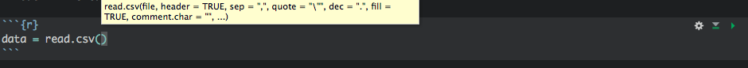
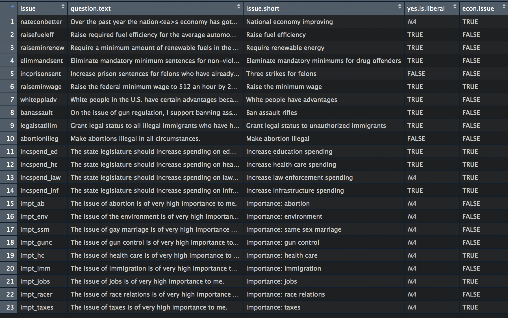

          
          
## Get organized


<section>
</section>

## Your audiences, in decreasing order

- Your future self
- Your collaborators
- Replicators 


## Good organizational principles


## One script per task

- In general, each scipt should do a specific high-level task
- Figuring out where to break up scripts is more of an art than a science, but some rules of thumb 
- If you are at a point in your workflow where it would make sense to save something - a dataset, a model object, a few figures, etc, that is often a good time for a new script 


## Mind the order 
- Complex tasks will require multiple scripts
- Use organizing tools like RStudio's Projects
- Number scripts in order: `0_clean_data.R`, `1_merge_census_data.R`, `3_fit_multilevel models.R`


## Automate everything that can be automated
- Saves yourself time
- Prevents mistakes
- Sometimes comes at the cost of more time up front and code readability


## DON'T REPEAT YOURSELF

- Inefficient
- Invites mistakes
- Makes even simple tweaks to code take forever to implement 
- Ask yourself, "could this code do this task 100 times?"


## Don't copy and paste
- Call things from where they are stored
- Typically, this will be on your disk or on some remote/cloud disk you can access from your machine
- If your code calls for the same task to be repeated, find ways to automate 


## Set up lists you can iterate over
- If you're doing the same task over and over, you want to iterate over a list
- Strategies for doing this depend on task and language
- for loops
- apply functions 


## Understand your file structure
- Find an organization that works for you, and be consistent
- [One approach to file structures for R projects](https://www.r-bloggers.com/a-meaningful-file-structure-for-r-projects/) 
- 
- [An excellent tutorial about organized workflow in R](https://apps.fishandwhistle.net/archives/961) 


## Paths
- Paths are how your program finds what it needs to
- You shouldn't be clicking on datasets or files to load them


## Modern IDES can autocomplete paths

 


## Setting a working directory
- Each script should have a "working directory"
- This is where your program will search for files referenced in the script, write any files you create using the script, etc.
- R: 
```{r, eval = FALSE}
setwd("/Users/cskovron/Dropbox/Research/ncs-constituent-eval/analysis")
# on Mac is equivalent to
setwd("~/Dropbox/Research/ncs-constituent-eval/analysis")
```
- Python:
```{python, eval = FALSE}
import os
path="~/Dropbox/Research/ncs-constituent-eval/analysis"
os.chdir(path)
```
- Command line:
```{bash, eval = FALSE}
cd "~/Dropbox/Research/ncs-constituent-eval/analysis"
```

## In R, convention is now to use RStudio "Projects"
- This improves reproducibility but is a little more advanced, so I encourage you to look at it on your own if you are an R specialist 


## Navigating, relational paths
- After you set your working directory, you'll want to use it to navigate around
- Typically in your program, you can refer to anything in the working directory without prefacing it with anything 
```{r, eval = FALSE}

dat <- read.csv("some-file-in-your-working-directory.csv", stringsAsFactors = FALSE)

```


## Setting relative paths - Unix-based systems including Mac 
- You can set paths at levels outside your working directory
- `~` Your home directory (on my Mac, `/Users/cskovron/`)
- `.` The current directory (`./images/` is a subfolder of the working directory called `images`)
- `..` The parent of the current directory (the directory the working directory is in)


## Don't change your working directory to save to a subfolder

- Just do:
```{r, eval=FALSE}
write.csv(some.data.to.save, "./data-subfolder/data-filename.csv")
```


## Paths don't play nicely between Windows and Unix systems
- [A tutorial on making your Python code portable between Windows and Unix](https://medium.com/@ageitgey/python-3-quick-tip-the-easy-way-to-deal-with-file-paths-on-windows-mac-and-linux-11a072b58d5f)


## Version control 

- Simplest definition -- lets you revert to the past
- Track changes made by collaborators
- Document your contributions to code 


## Version control options

- Git/github
  - [A tutorial on getting started with GitHub Desktop](https://programminghistorian.org/en/lessons/getting-started-with-github-desktop)
  - [A tutorial on GitHub integration with R Studio](http://r-pkgs.had.co.nz/git.html)
- Dropbox is a good option, though less control than git 
- Collaboration is tough - live editing code for Python and R are coming but not common right now. More likely, one collaborator should be in a file at a time 


## Tidy data principles 

- Every data task will be different, but tidy data principles will help you keep organized
- Much of your workflow will be getting data inputs into a tidy format
- From the beginning, lay out what you need your dataset to look like to do the analyses you want, then work backward from there
- [Hadley's vignette on tidy data principles](https://cran.r-project.org/web/packages/tidyr/vignettes/tidy-data.html)
- [Chapter of R for Data Science on tidy data](http://r4ds.had.co.nz/tidy-data.html)


## Long data


## Wide data


## Relational data 
- Some data has structures more complex than simple tables
- For example, Netflix has a database where each user has a table of movies they've watched and a separate table for each movie of the users who have watched it
- This is "relational data"
- It's often, but not always, big 
- Requires special tools, usually SQL 


## Checking up on your data cleaning
- glance at your data: 
    - `View()` (but be careful!)
    - `summary()` (be careful on big datasets)
    - `head()` and `tail()`
    - `tibble::glimpse()`
    - `is.na()` and `sum(is.na())`


## Set yourself up to do things iteratively

- In one paper, I do the same analysis for many survey items
- To automate this, I made a helper file called `issues.names.titles.csv`



## Tricks for doing things iteratively

- Use `paste()` and `paste0()` to help write captions and labels
- Can select columns using variables: `data[, issue]`, if `issue` is a character vector, selects just that column. Loop over issues 


## Where to work? Development environments
- Let your software do some of the work for you
- RStudio projects
- RStudio gets new features every day that help you stay organized
- RMarkdown allows you to integrate R code and writing to produce reports in HTML and PDF, slides, etc. Very flexible and extendable 


## Get organized to learn in the future

- Follow #rstats on twitter
- [I made a twitter list of good R follows here](https://twitter.com/cskovron/lists/rstats)
- Star your favorite packages on github and follow developers


